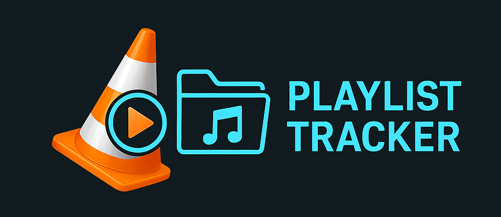

# 🎧 VLC Playlist Tracker

<p align="center">
  
</p>

A lightweight VLC extension that remembers **which file you last played inside any folder/playlist** and automatically restores the playback next time you open that folder.

## ⭐ Why This Exists

Unlike individual media files, VLC does not remember which file you were last watching when opening a folder.  
Existing solutions only track progress **per playlist level**, also doesnt work for complex/nested folder structures.

This extension fixes that by:

- Saving progress **per folder/playlist**  
- Using a **centralized JSON state file** for all folders  
- Restoring the exact last played file reliably across sessions  
- Working well with large, nested course folders and series


## ⚠️ Important Notes (Required for Correct Functionality)

For playlist index tracking to work correctly, adjust these settings:

Go to **Preferences → Show All (bottom left)** → **Playlist**:

1. Subdirectory behavior → **Expand**  
2. Use media library → **Off**  
3. Playlist tree → **Off**

These ensure VLC builds a flat, predictable playlist so the extension can restore file positions accurately.


## 📝 Technical Note: Playlist ID's vs Index

VLC assigns a **dynamic playlist ID** to each media item, and these IDs are *not consistent* across sessions or when a folder is reopened.  
However, the **playlist index** (the position of the file inside the playlist/folder) is always stable.

Because `vlc.playlist.goto()` only accepts **IDs**, the extension must translate between the two.  

To handle this reliably, the extension uses helper functions to:

- map **index → id** when restoring playback  
- map **id → index** when saving progress  

This is why the extension uses custom helper functions like `get_id_for_index()` and `get_index_for_id()` to reliably translate between VLC’s unstable IDs and stable playlist positions.

This index–ID mapping is the core trick that allows the extension to resume the correct file every time, even across complex or nested folder structures.

## 📥 Installation

### 1. Locate your VLC extensions folder

**macOS**
```bash
~/Library/Application Support/org.videolan.vlc/lua/extensions/
```

**Windows**
```bash
%APPDATA%\vlc\lua\extensions\
```

(Create folders if missing.)

### 2. Copy the script

Place the file:

```bash
vlc_playlist_tracker.lua
```

inside the `extensions` directory.

### 3. Restart VLC

Then enable the extension via:  
**View → Playlist Tracker**

## ▶️ How to Use

1. Open any folder of media files in VLC  
2. Enable the extension via **View → Playlist Tracker**  
3. Watch normally — your progress is saved automatically  
4. When reopening the same folder later and enabling the extension again:  
   **VLC jumps directly to the last file you were on**

Simple, automatic, persistent.

## 🌟 Credits
Crafted by me  
Supercharged with some snippets, explanations & visuals by ChatGPT 🚀

## 🤝 Contribute

PRs and improvements welcome.
